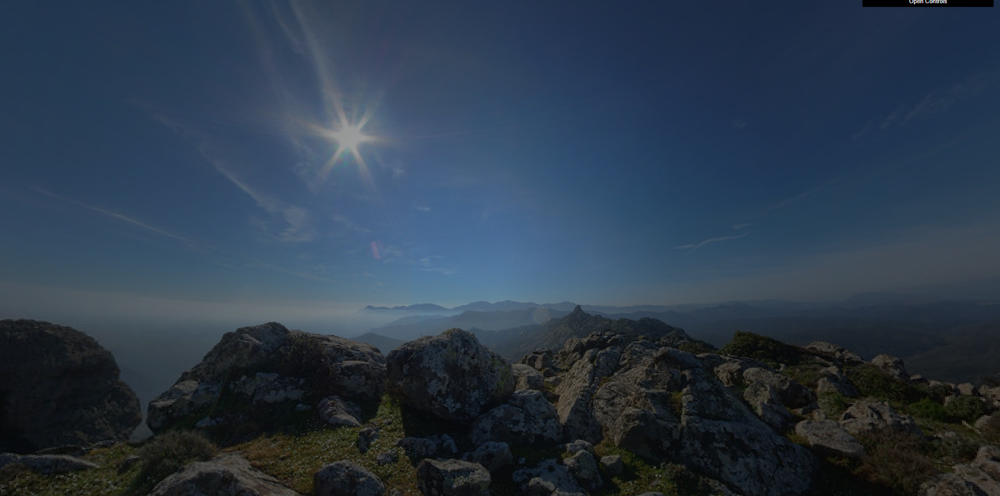
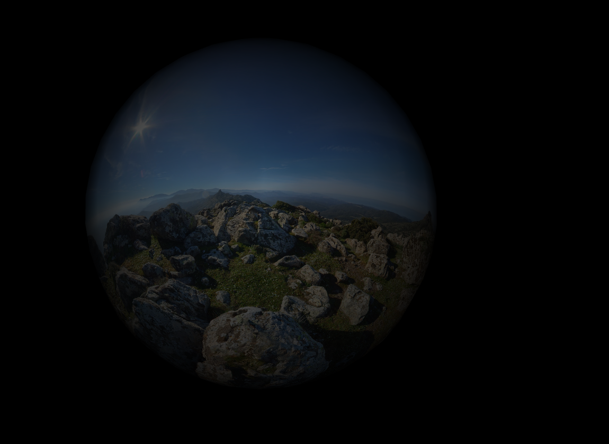
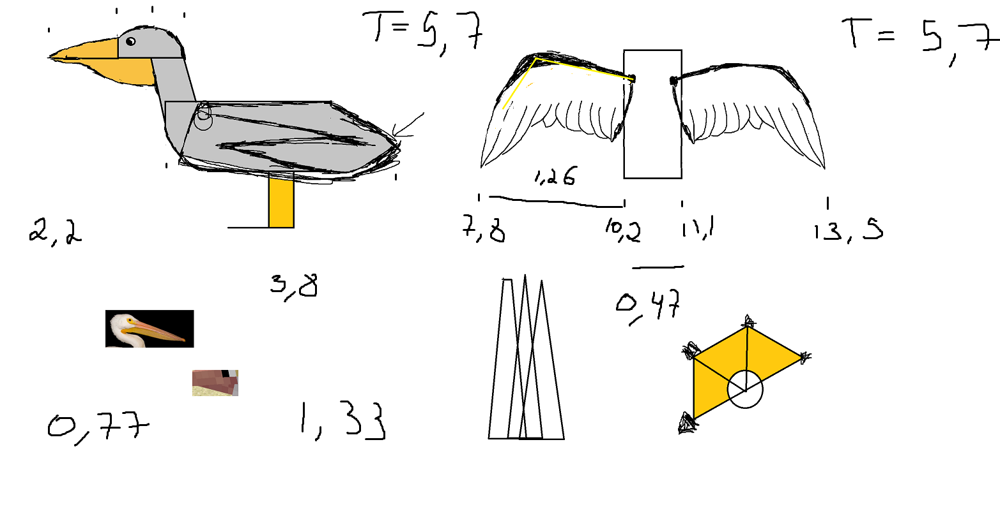
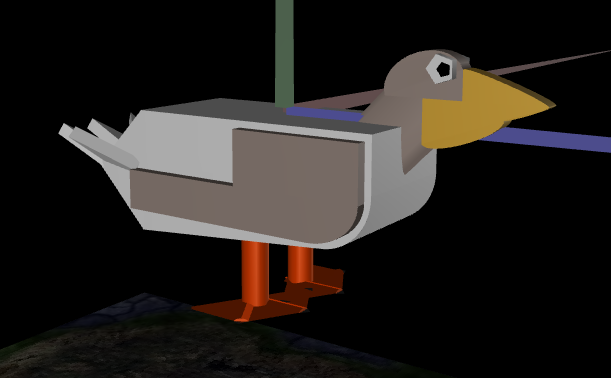
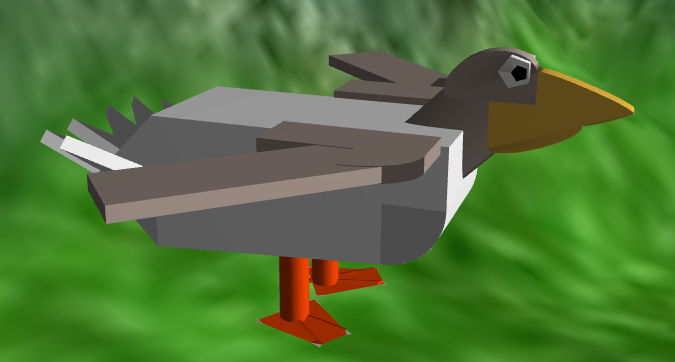
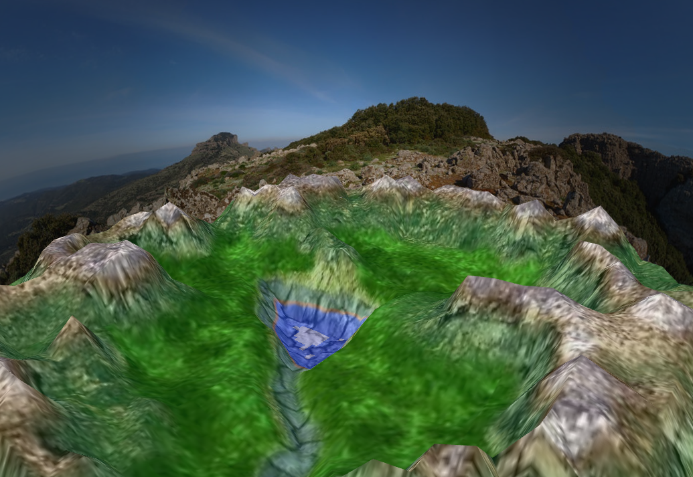
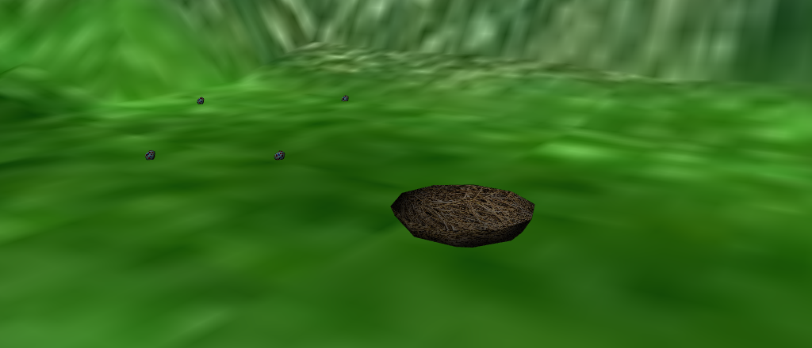
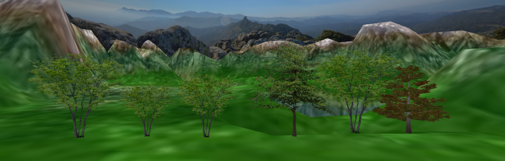
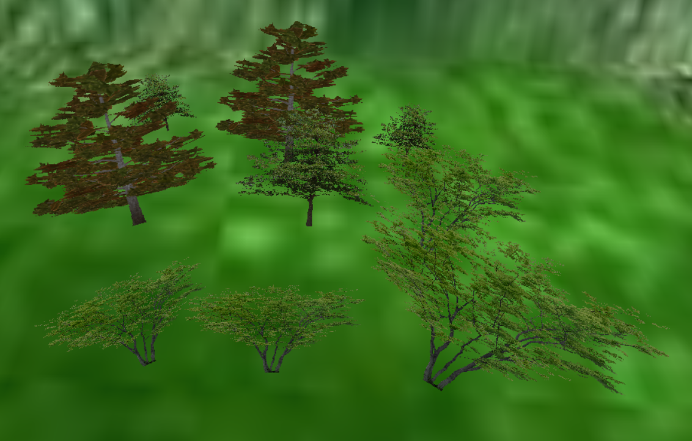
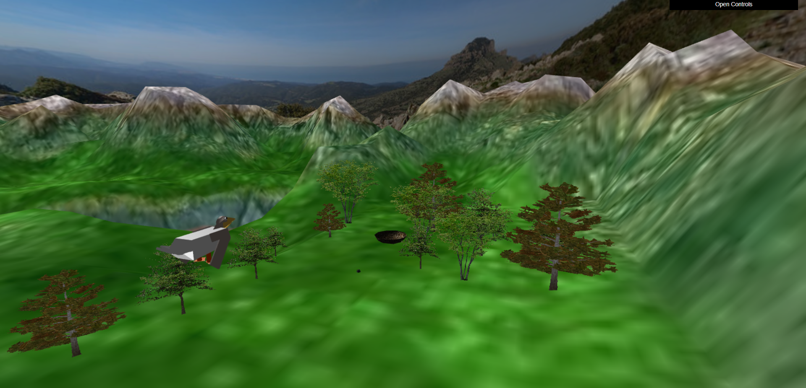

# CG 2022/2023

## Group T10G12
| Name             | Number    | E-Mail             |
| ---------------- | --------- | ------------------ |
| José Ramos       | 202005460 | up202005460        |
| Matheus Utino    | 202211693 | up202211693        |

## Project Notes

## Section 1

In this section we built a sphere and put a texture over it, overall this was very easy since we did almost the same thing in the tp's.

## Section 2

In this section we had to apply a texture to the interior of the sphere, this was no big deal, we simply changed the normals and applied the texture accordingly.

### Inside the panorama

### Outside the panorama

## Section 3

In this section we were tasked to create, animate and control the bird.

### 3.1

Creating the bird was easy but troublesome and time consuming, in the beginning we did some sketches, having some inspiration in a pelican, but in the end it looked more like a duck.

### Sketches

Initially we though the bird needed to have a walking animation, hence we had made the bird with his wings tucked, but later on in the project we notice that this was not the case, so we changed our design to it always having its wings open.

### Wings closed

### Wings opened

### 3.2

The animation was a bit tricky in the beginning because we thought it had to be done with shaders, but then the were given an example of how to do it, after that it was smooth sailing. Although we initially forgot to animate the bird going up and down we fixed that in a later stage.

### 3.3

The controls were very straight forward, we simply copy pasted what was given, after the fact we applied some trigonometric logic and made the bird move in the direction it was facing.

## Section 4

In this section we had to create the terrain, wich a bit complicated in some parts.
Although we had done this in a previous tp, we didn't really know how to do it, if it was not for the teachers help we would probably get stuck here. But we still made it happen.

### Terrain

## Section 5

In this section we had to create the eggs, nest and two animations, one for the bird and one for the egg.
Creating the egg was the easiest part. It was basiclly repeating section 1 again.
On the other hand the nest was very hard due to the shape of the nest. We optioned to use a half sphere wich was harder to do than we had in mind. After that when we tried to apply the texture, we were not capable of making it visible both inside and out, so we had to create two objects, one was the outside and the other was the inside of the sphere.

### Eggs and nest

The animation was what took the longest to do, mainly because of its complexity, but also because of fine tuning. But it was not too hard to do, it only took a long time.

## Section 6

In this section, we will initially create a billboard, and from this object, we will create a forest, one in a 3x3 grid and another in a straight line.

### 6.1

In this topic, the objective was to create a billboard by applying a texture to the MyQuad object, and make the figure rotate along with the camera movement, i.e., follow the viewer's perspective. In this part, we encountered a major issue in achieving this, despite following the provided guidelines in the project. Additionally, a modification was made in the CGF library so that pixels with transparency less than one in the PNG image are not displayed on the screen.

### 6.2

From the billboard object, we can now create a forest. In this case, we will create a version in a 3x3 grid and another in a straight line. In both cases, random variations in the x and z coordinates will be added, as suggested in the prompt, to create a more natural environment. Additionally, there will be variations in the height of the trees and their textures.

## Section 7

As an additional feature, we chose the first option provided, which is to have the egg dropped in a parabolic trajectory by the bird. To achieve this, we relied on basic physics to simulate the motion of a horizontal projectile.

