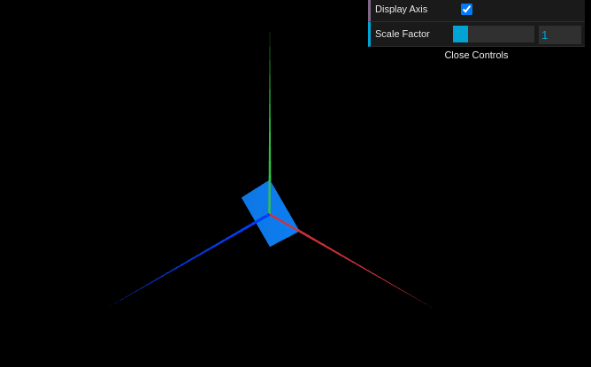

# CG 2022/2023

## Group T10G12

## TP 1 Notes

- In exercise 1 we had some difficulties when starting out, but after analyzing the MyDiamond.js and MyScene.js, we were able to breeze trough the exercises with relative ease. We learned that the vertices were the points that would be used to connect with the indices through coordinates, and in the parallelogram we learned that we can’t just connect all the dots together and that we need to create a series of triangles to form the object, also if we wanted to make a object double sided we just needed to copy the indices and switch the end numbers, ex: a, b, c,  c, b, a : would be double sided. Has for the checkboxes we needed to create a variable that was instantiated, either false or true, so that we could use an if statement to display an object or not, has for the interface we copied the axis example and replaced the variable with objX, and renamed it so that it would make sense.

- In exercise 2 we had no difficulties nor learned anything new, we simply used what we already knew from the previous exercise.

