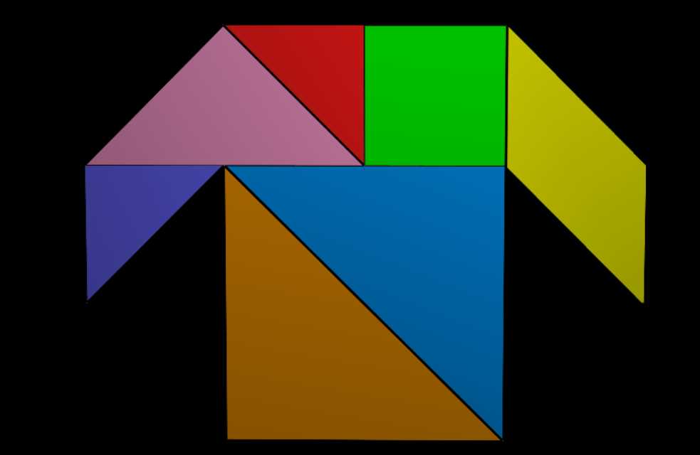
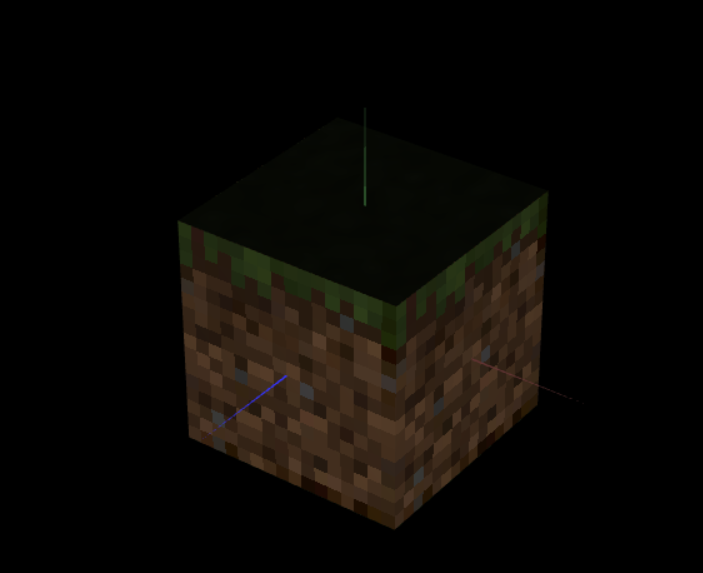

# CG 2022/2023

## Group T10G12

## TP 4 Notes

- For the first part of this exercise, we associated the vertices of the objects which compose the tangram with the vertices of tangram.png texture. Also this, we plot MyTangram object, obtain the figure below. This method is easier to colorize objects about the method used during the last exercise.

- The second part we change MyUnitCubeQuad class to receive 6 textures, one for each face of the cube. After this, we set the texture for each face, apply and finally display the object. The quality of image is very bad since the original texture is 16x16 pixels, i.e., a low resolution and by default CGF uses linear filtering which don't provide a good approximation. So to improve the quality we can use a nearest filtering  which is more robust and provide a better approximation.

