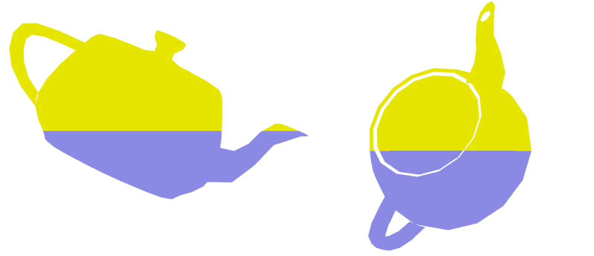
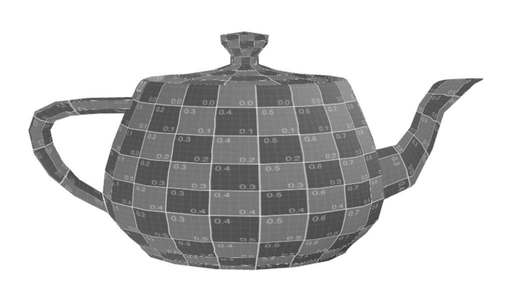
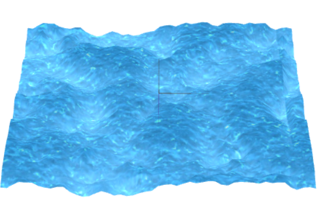

# CG 2022/2023

## Group T10G12

## TP 5 Notes

- In the first exercise we don't have many difficulties, only need to obtain the coordinates of vertices after transformation. The result is shown bellow. 

- After this, we apply animation in the teapot for translate in axis x using a timefactor. We learned how to animate the objects in the scene. 

- In sequence we converted RGB color to grayscale, using the equation L = 0.299R + 0.587G + 0.114B, where L is the new color of all dimensions and R is red, G is green and B is blue color of RGB.

- In the last part we had several difficulties to get a good result of water shader. We didn't know exactly produce the result shown in the example of Moodle, basically we apply a combination of texture of map and tex using a proportion of both. Perhaps we can improve the quality of shape of waves.

